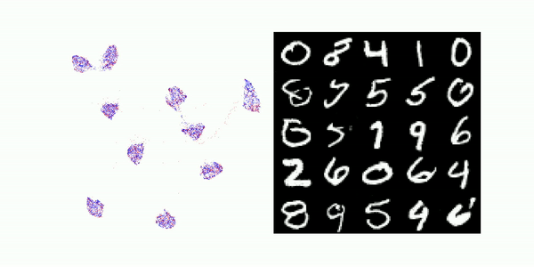

# Latent Perturbation



This repository contains the official implementation for _Controlling GAN Generation with Deep Latent Perturbation_i

## Getting Started

Clone the repo:

```
git clone https://github.com/evendrow/cs236g.git
```

Clone this repo to get the GAN models, and place it in the same directory as this repo:
```
git clone https://github.com/csinva/gan-vae-pretrained-pytorch
```
Now, you can generate samples from the regular and perturbed MNIST gan by simply running:
```
python run.py
``
